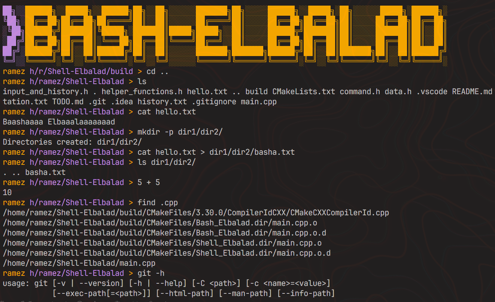

# > Bash-Elbalad 

Now finally, we can fight using owr own commands along **El-7ag Ebrahim Semple** to defeat **Valanteno Elbalad**. ☝🏻


**Bash-Elbalad** is a simple Linux shell project designed to mimic basic shell functionalities, aiming to provide a hands-on experience with core Linux shell operations, command execution, file management, and advanced features like piping and redirection.



## 🤝 Collaboration

This project was brought to life in collaboration with [@aelaraby6](https://github.com/aelaraby6). Working together, we not only built a functional shell but also gained invaluable experience in teamwork, communication, and problem-solving.


## ⚡ Features

### **Core Functionality**
- **Core Shell Functions**: Custom prompt, command execution, history tracking, and arrow key navigation.  
- **File Management**: Supports `cat`, `touch`, `rm -f`, `mv`, `cp`, `ls -l`, `mkdir -p`, and `rmdir`.  
- **Command Composition**: Supports redirection (`>`), and multiple commands (`;`).  


## 🛠️ Project Setup

Clone the repo, compile, and let the shell magic begin:

```bash
# Clone the repository
git clone https://github.com/r6mez/Bash-Elbalad.git
cd Bash-Elbalad

# Create a build directory and compile using CMake
mkdir build
cd build
cmake ..
make

# Run the shell
./Bash_Elbalad
```

## 📂 Project Structure
```
Bash-Elbalad/
├── command.h             # Command execution logic
├── data.h                # Data structures and global variables
├── general_commands.h    # Basic shell commands
├── helper_functions.h    # Utility functions for shell operations
├── input_and_history.h   # Input handling and command history
├── main.cpp              # Entry point of the shell
├── README.md             # Project documentation
```

## 📝 Todo

Check out our [TODO.md](TODO.md).